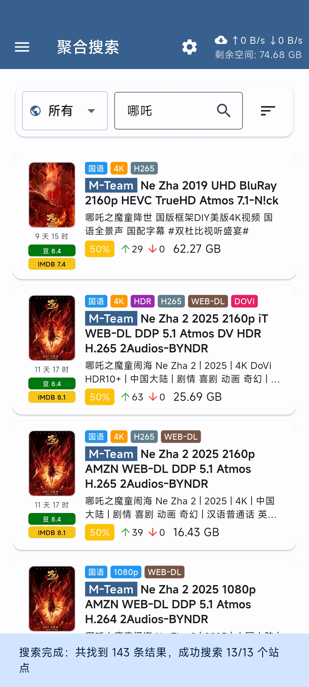
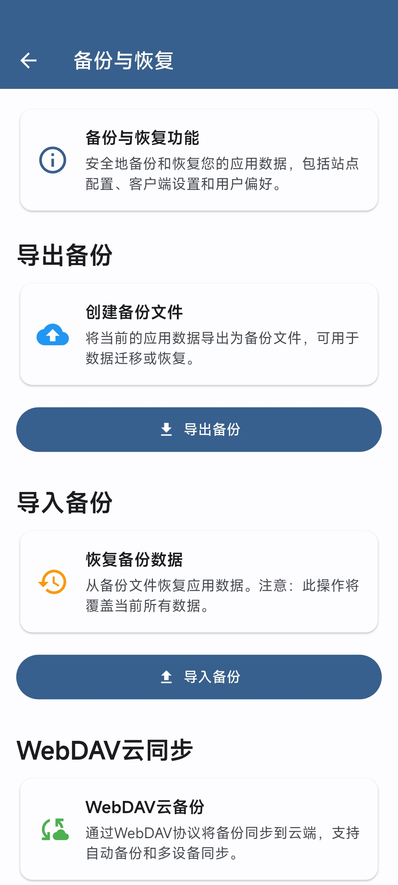

# PT Mate（PT伴侣）

基于 Flutter（Material Design 3）开发的私有种子站点客户端，支持多种PT站点的种子浏览、搜索和下载管理。目前支持M-Team和NexusPHP类型的站点。

---

📣 **官方交流群（Telegram）**

[加入 PT Mate 官方交流群](https://t.me/pt_mate) 来获取最新公告、功能讨论与使用帮助。

---
## 功能特性

### 核心功能
- **种子浏览**：支持按分类（综合/电影/电视）浏览最新种子资源
- **种子收藏**：支持收藏种子，方便后续查看和管理
- **搜索功能**：关键词搜索，支持分类筛选
- **动态查询条件**：支持自定义搜索分类和查询参数，灵活配置搜索条件，相当于变相支持了高级搜索
- **聚合搜索**: 支持多网站多线程聚合搜索
- **种子详情**：查看种子详细信息、截图预览、文件列表
- **批量操作**：支持批量收藏和下载种子，长按触发
- **下载管理**：集成 qBittorrent 与 Transmission，支持一键下载到远程下载器
- **本地中转**：支持本地中转模式，先下载种子文件再提交给下载器

### 下载器集成
- **多下载器管理**：支持添加、编辑、删除多个下载器实例（qBittorrent、Transmission）
- **连接测试**：自动验证下载器连接状态
- **分类标签**：自动获取下载器的分类和标签配置
- **实时状态**：显示下载器的上传/下载速度和剩余空间

### 用户体验
- **Material Design 3**：现代化的界面设计
- **响应式布局**：适配不同屏幕尺寸
- **图片查看器**：支持缩放、平移的全屏图片浏览
- **安全存储**：敏感信息（Passkey、密码）安全加密存储
- **数据备份与恢复**：支持导出应用配置和数据到本地文件，支持webdav

### 截图
<p align="center">
  
  
  
</p>


## 使用说明

### 移动设备左滑操作

在移动设备上，您可以通过左滑种子列表项来快速访问常用操作：

#### 可用操作
- **收藏/取消收藏**：左滑后点击心形图标可以收藏或取消收藏种子
- **下载**：左滑后点击下载图标可以直接下载种子到配置的下载器

#### 操作说明
1. 在种子列表中，向左滑动任意种子项
2. 滑动后会显示操作按钮（收藏和下载）
3. 点击对应按钮执行相应操作
4. 点击列表其他区域或向右滑动可以隐藏操作按钮

> **提示**：左滑操作在聚合搜索和普通搜索页面都可以使用，让您在移动设备上更便捷地管理种子。

### 动态查询条件配置

应用支持自定义搜索分类和查询参数，让您可以根据需要灵活配置搜索条件。

#### 配置步骤
1. 进入应用设置页面
2. 找到「搜索分类配置」部分
3. 可以点击获取让程序自动获取现有的分类信息
4. 也可以自定义：点击「添加分类」或编辑现有分类
5. 配置分类信息：
   - **显示名称**：在下拉框中显示的分类名称
   - **查询参数**：搜索时使用的参数配置

#### 参数格式

支持两种参数格式：

**推荐格式：JSON**
```json
{"mode":"normal","teams":["44","9","43"]}
```

**兼容格式：键值对（分号分隔）**
```
mode:"normal";teams:["44","9","43"]
```

#### 参数说明(m-team)
- `mode`：搜索模式（如 "normal"、"movie" 等）
- `teams`：制作组ID数组
- `categories`：分类ID数组 （数组格式，如：["407", "420"]）
- `discount`：促销（如 "FREE"、"PERCENT_50" 等）
- 
#### 参数说明(nexus php api)
- 直接看接口文档：[NexusPHP API 文档](https://s.apifox.cn/43608c09-bab0-4e2e-9a56-77ffa629c8e0/api-87956324)
#### 参数说明(nexus php api)
- 在浏览器中过滤好你的条件打开想要展示的内容，然后观察地址栏的url，最终将请求参数转为json格式。
- 例如：`https://nexusphp.org/torrents.php?cat=404&inclbookmarked=0&incldead=1&spstate=0&seeders_begin=1&seeders_end=1&page=0`
- category参数（特别）：它的格式是`分区#分类id`，所以首先观察请求地址是torrents.php还是special.php
  - 如果是torrents.php，那么category参数的格式就是`narmal#分类id`
  - 如果是special.php，那么category参数的格式就是`special#分类id`
  - 这里要注意下分类id前面要加上cat三个字母，例如：`cat407`。举个完整点的例子，如果请求地址为`torrents.php?cat=403`那category的值就是`normal#cat403`
  - 特殊情况：无分类，这时看一下分区，如果是torrents.php那么可以直接不传category字段，如果是special分区则必须传category字段，值为`special#`
- 其他参数： 直接按键值对转换就行，如：`{"inclbookmarked":"0","incldead":"1","spstate":"0","seeders_begin":"1","seeders_end":"1"}`
- 最终的转换结果就是：
  ```json
  {"category":"normal#cat404","inclbookmarked":"0","incldead":"1","spstate":"0","seeders_begin":"1","seeders_end":"1"}
  ```
- 最后实在看不懂上面的说明也可以使用ai，将你的页面地址还有上面的参数说明一起输入，让ai帮助你生成你要的参数。
  比如：`我当前的地址是http://xxx，请帮我按以下说明转为json格式。(把上面的说明复制进去)`。

#### 特别注意
> m-team 的 pageNumber、pageSize、keyword、onlyFav 以及 nexusPHP 的 page、pageSize、search、inclbookmarked 这几个参数不能自定义配置，因为这几个参数是用来动态设置用来分页以及查询的，自定义配置会导致查询结果及分页错误。

#### 使用示例（m-team）

**电影分类配置**
```json
{"mode":"movie"}
```

**特定制作组配置**
```json
{"mode":"normal","teams":["44","9"]}
```

**免费筛选配置**
```json
{"mode":"normal","discount":"FREE"}
```

配置完成后，在主页面的分类下拉框中选择对应分类即可使用自定义的查询条件进行搜索。

### NexusPHP Web 类型站点使用说明

对于 NexusPHP Web 类型的站点，应用会弹出内置的登录界面供用户完成登录认证。

#### 登录流程
1. 选择 NexusPHP Web 类型站点后，应用会自动弹出登录界面
2. 在弹出的界面中输入用户名和密码完成登录
3. 登录成功后，应用会自动获取必要的 Cookie 信息
4. 正常情况下登录界面会自动关闭

#### 手动关闭登录界面
如果登录已完成但界面长时间没有自动关闭，您可以：
- 点击登录界面右上角的关闭按钮手动关闭
- 手动关闭不会影响 Cookie 的获取和保存
- 关闭后即可正常使用站点功能

## 项目结构

```
lib/
├── app.dart                        # 应用入口、路由配置
├── main.dart                       # 主函数
├── models/
│   └── app_models.dart             # 数据模型定义
├── pages/
│   ├── about_page.dart             # 关于页面
│   ├── aggregate_search_page.dart  # 聚合搜索页面
│   ├── aggregate_search_settings_page.dart # 聚合搜索设置页面
│   ├── backup_restore_page.dart    # 备份恢复页面
│   ├── download_tasks_page.dart    # 下载任务页面
│   ├── downloader_settings_page.dart # 下载器设置页面
│   ├── server_settings_page.dart   # 服务器设置页面
│   ├── settings_page.dart          # 设置页面
│   └── torrent_detail_page.dart    # 种子详情页面
├── providers/
│   └── aggregate_search_provider.dart # 聚合搜索状态管理
├── services/
│   ├── api/                        # API 服务
│   │   ├── api_service.dart        # API 服务基类
│   │   ├── mteam_adapter.dart      # M-Team 适配器
│   │   ├── nexusphp_adapter.dart   # NexusPHP 适配器
│   │   ├── nexusphp_web_adapter.dart # NexusPHP Web 适配器
│   │   └── site_adapter.dart       # 站点适配器基类
│   ├── downloader/                 # 下载器相关
│   │   ├── downloader_client.dart  # 下载器客户端基类
│   │   ├── downloader_config.dart  # 下载器配置
│   │   ├── downloader_factory.dart # 下载器工厂
│   │   ├── downloader_models.dart  # 下载器数据模型
│   │   ├── downloader_service.dart # 下载器服务
│   │   ├── qbittorrent_client.dart # qBittorrent 客户端
│   │   └── transmission_client.dart # Transmission 客户端
│   ├── storage/                    # 存储服务
│   │   └── storage_service.dart    # 本地存储服务
│   ├── theme/                      # 主题服务
│   │   └── theme_manager.dart      # 主题管理
│   ├── aggregate_search_service.dart # 聚合搜索服务
│   ├── backup_service.dart         # 备份恢复服务
│   ├── image_http_client.dart      # 图片加载客户端
│   ├── site_config_service.dart    # 站点配置服务
│   └── webdav_service.dart         # WebDAV 服务
├── utils/
│   ├── backup_migrators.dart       # 备份数据迁移器
│   ├── downloader_utils.dart       # 下载器工具函数
│   └── format.dart                 # 格式化工具函数
└── widgets/
    ├── app_drawer.dart             # 应用侧边栏
    ├── cached_network_image.dart   # 缓存网络图片组件
    ├── nexusphp_web_login.dart     # NexusPHP Web 登录组件
    ├── qb_speed_indicator.dart     # qBittorrent 速度指示器
    ├── responsive_layout.dart      # 响应式布局组件
    ├── server_settings_back_button.dart # 服务器设置返回按钮
    ├── torrent_download_dialog.dart # 种子下载对话框
    └── torrent_list_item.dart      # 种子列表项组件
```

## 技术栈

- **Flutter**: 跨平台移动应用框架
- **Provider**: 状态管理
- **Dio**: HTTP 客户端
- **SharedPreferences**: 本地配置存储
- **FlutterSecureStorage**: 敏感信息安全存储
- **DeviceFrame**: 设备预览框架

## 快速开始

### 环境要求
- Flutter SDK 3.0+
- Dart SDK 3.0+
- Android Studio / VS Code

### 安装依赖
```bash
flutter pub get
```
如果你新增了网站配置，请手动运行`generate_sites_manifest.sh`脚本来更新站点清单文件，
或者把以下内容写到你的`.git/hooks/pre-commit`文件中：
```bash
#!/bin/sh

# 检查 assets 目录下是否有变动
if git diff --cached --name-only | grep -q ^assets/; then
    echo "检测到 assets 目录变动，执行 generate_sites_manifest.sh..."
    
    # 执行脚本
    ./generate_sites_manifest.sh
    if [ $? -ne 0 ]; then
        echo "generate_sites_manifest.sh 执行失败，提交已取消。"
        exit 1
    fi

    # 自动把生成的文件加入本次 commit
    if [ -f assets/sites_manifest.json ]; then
        git add assets/sites_manifest.json
        echo "assets/sites_manifest.json 已加入本次提交。"
    else
        echo "警告: assets/sites_manifest.json 没有生成！"
    fi
fi

exit 0
```
### 运行应用
```bash
# 调试模式
flutter run

# 发布模式
flutter run --release
```

### 构建 APK
```bash
# 调试版本
flutter build apk --debug

# 发布版本
flutter build apk --release
```
### 适配新网站
- 新增网站配置文件到 `assets/sites/` 目录
- 运行 `generate_sites_manifest.sh` 脚本更新清单文件
- 测试新网站功能是否正常
详见[网站配置指南](./SITE_CONFIGURATION_GUIDE.md)


## 配置说明

### 站点配置
- 支持多种PT站点类型（M-Team、NexusPHP）
- 支持自定义站点域名
- 使用 Passkey 进行身份验证
- 自动保存登录状态

### 下载器配置（qBittorrent / Transmission）
- 支持多个下载器实例
- 自动获取分类和标签
- 支持本地中转下载模式

## 安全性

- 所有敏感信息（Passkey、密码）使用 FlutterSecureStorage 加密存储
- 不在日志中记录敏感信息
- 支持 HTTPS 证书验证

## 许可证

MIT License - 详见 [LICENSE](LICENSE) 文件
